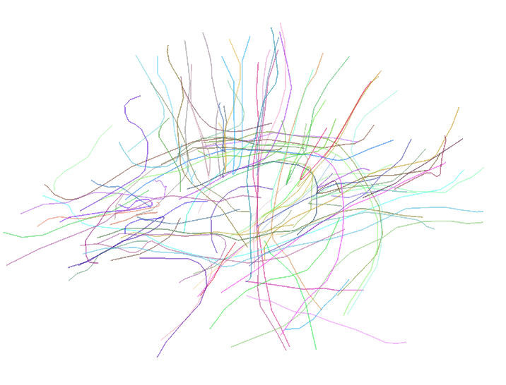

Dipy is an international, **free** and **open** software project for **diffusion** magnetic resonance imaging analysis in Python. The project is at a massive development at the moment and many things are likely to change the following months. However, if you are already using this software for your research please remember to cite us. 

If you are using the Local Skeleton Clustering (LSC) method please cite:

**Fast Dimensionality Reduction for Brain Tractography Clustering**, E. Garyfallidis, M. Brett, I. Nimmo-Smith, HBM 2010.

For non-clustering related projects please cite:

**Identification of corresponding tracks in diffusion MRI tractographies**, E. Garyfallidis et.al. ISMRM 2010.

More papers are on their way and please see our :ref:`documentation` for more detail.

The core development team consists of the following individuals:

- Eleftherios Garyfallidis (leading programmer), University of Cambridge
- Ian Nimmo-Smith, MRC - Cognition and Brain Sciences Unit
- Matthew Brett, University of California, Berkeley
- Bago Amirbekian, University of California, San Fransisco
- Frank Yeh, Carnegie Mellon University
- Christopher Nguyen, University of California, Los Angeles
- And your name here ...

**Join in the fun!**
 

.. We need the following toctree directive to include the documentation
.. in the document heirarchy - see http://sphinx.pocoo.org/concepts.html
.. toctree::
   :hidden:

   documentation

