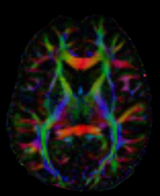

.. _home:

###########################
Diffusion Imaging In Python
###########################

DIPY_ is the paragon 3D/4D+ imaging library in Python. Contains generic methods for
spatial normalization, signal processing, machine learning, statistical analysis
and visualization of medical images. Additionally, it contains
specialized methods for computational anatomy including diffusion,
perfusion and structural imaging.

**********
Highlights
**********

**DIPY 1.5.0** is now available. New features include:

- New reconstruction model added: Q-space Trajectory Imaging (QTI).
- New reconstruction model added: Robust and Unbiased Model-BAsed Spherical Deconvolution (RUMBA-SD).
- New reconstruction model added: Residual block Deep Neural Network (ResDNN).
- Masking management in Affine Registration added.
- Multiple Workflows updated (DTIFlow, DKIFlow, ImageRegistrationFlow) and added (MotionCorrectionFlow).
- Compatibility with Python 3.10 added.
- Migrations from Azure Pipeline to Github Actions.
- Large codebase cleaning.
- New parallelisation module added.
- ``dipy.io.bvectxt`` module deprecated.
- New DIPY Horizon features (ROI Visualizer, random colors flag).
- Large documentation update.
- Closed 129 issues and merged 72 pull requests.

See :ref:`Older Highlights <old_highlights>`.

*************
Announcements
*************
- :doc:`DIPY 1.5.0 <release_notes/release1.5>` released March 11, 2022.
- :doc:`DIPY 1.4.1 <release_notes/release1.4.1>` released May 6, 2021.
- :doc:`DIPY 1.4.0 <release_notes/release1.4>` released March 13, 2021.

See some of our :ref:`Past Announcements <old_news>`

***************
Getting Started
***************

Here is a quick snippet showing how to calculate `color FA` also known as the
DEC map. We use a Tensor model to reconstruct the datasets which are
saved in a Nifti file along with the b-values and b-vectors which are saved as
text files. Finally, we save our result as a Nifti file ::

    fdwi = 'dwi.nii.gz'
    fbval = 'dwi.bval'
    fbvec = 'dwi.bvec'

    from dipy.io.image import load_nifti, save_nifti
    from dipy.io import read_bvals_bvecs
    from dipy.core.gradients import gradient_table
    from dipy.reconst.dti import TensorModel

    data, affine = load_nifti(fdwi)
    bvals, bvecs = read_bvals_bvecs(fbval, fbvec)
    gtab = gradient_table(bvals, bvecs)

    tenmodel = TensorModel(gtab)
    tenfit = tenmodel.fit(data)

    save_nifti('colorfa.nii.gz', tenfit.color_fa, affine)

As an exercise, you can try to calculate `color FA` with your datasets. You will need
to replace the filepaths `fdwi`, `fbval` and `fbvec`. Here is what
a slice should look like.

**********
Next Steps
**********

You can learn more about how you to use DIPY_ with  your datasets by reading the examples in our :ref:`documentation`.

.. We need the following toctree directive to include the documentation
.. in the document hierarchy - see http://sphinx.pocoo.org/concepts.html
.. toctree::
   :hidden:

   documentation
   stateoftheart

*******
Support
*******

We acknowledge support from the following organizations:

- The department of Intelligent Systems Engineering of Indiana University.

- The National Institute of Biomedical Imaging and Bioengineering, NIH.

- The Gordon and Betty Moore Foundation and the Alfred P. Sloan Foundation, through the
  University of Washington eScience Institute Data Science Environment.

- Google supported DIPY through the Google Summer of Code Program during
  Summer 2015, 2016 and 2018.

- The International Neuroinformatics Coordination Facility.

.. include:: links_names.inc
