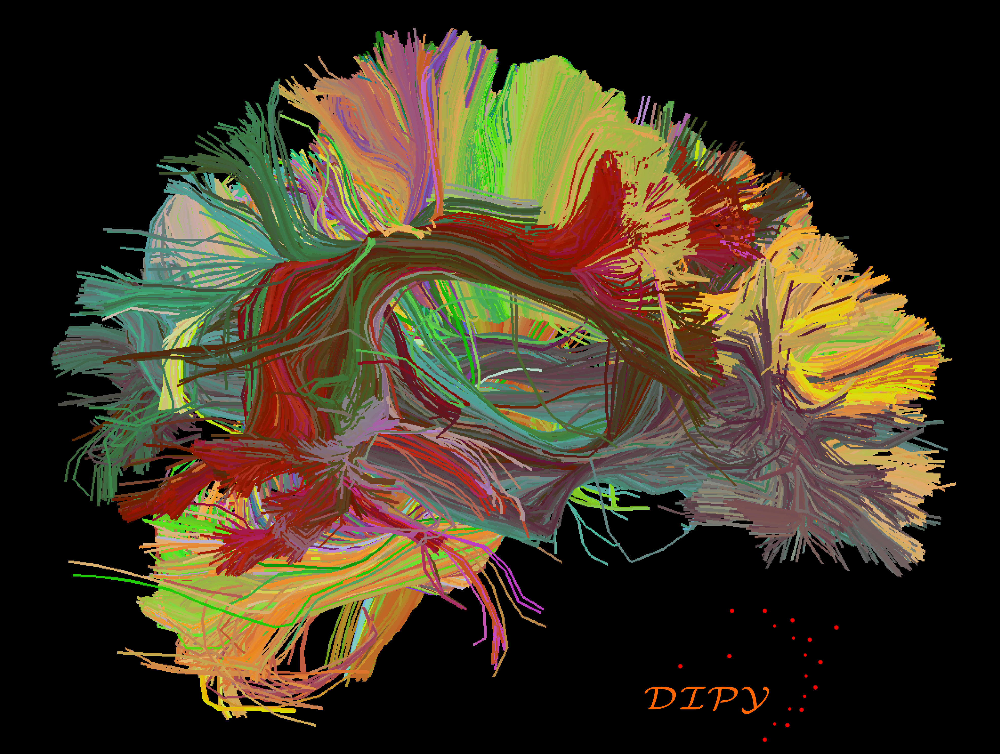

.. _introduction:

===============
 What is dipy?
===============

* **a python package** for analyzing ``diffusion data``

* a software library or **API**

* a **module** and a lightweight **toolkit**

* **a platform** to develop and test **old/new** algorithms

* part of a **bigger plan** - the nipy_ suite

* a new easy way to do diffusion **research**

* **quick**, **scriptable** and **readable**

* a project to contribute and **share** your code

* always **free**

* always **open source**

* **A new** *window* into the ``brain``.

Want to know more? Read our :ref:`documentation`, :ref:`installation` guidelines and try the :ref:`examples`. Didn't find what you are looking for? Then try :ref:`faq` and then if this doesn't help
either send an e-mail to our e-mail list nipy-devel@neuroimaging.scipy.org with subject starting with ``[dipy]``. We would love to help :-)

   **This is a depiction of tractography created with dipy**

   If you want to learn more how you can create these with your datasets 
   read the examples in our :ref:`documentation` .

.. include:: links_names.inc
