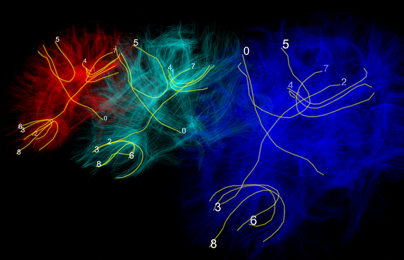

.. _introduction:

===============
 What is dipy?
===============

* **Dipy is a python package for analyzing diffusion data**

* **Dipy is a software library or API**

* **Dipy is a module and a toolkit**

* **Dipy is a platform to develop and test new algorithms**

* **Dipy is part of a bigger plan - the nipy suite**

* **Dipy is a new easy way to do diffusion research**

* **Dipy is fast but also clear and readable**

* **Dipy is a welcoming platform for those who want to contribute and share**

* **Dipy is and always be free**

* **Dipy is and always be open source**

* **Dipy shows new views of the brain.**

      
   **This is a depiction of track correspondence between three different brains**. 
   
   A few tracks were selected on the red brain and their corresponding tracks were found on the cyan
   and blue brains [1].
   If you want to learn more how you can create these with your datasets 
   read the examples in our :ref:`documentation` .
   
   [1] Garyfallidis E, Brett M, Tsiaras V, Vogiatzis G, Nimmo-Smith I (2010), *“Identification of corresponding tracks in diffusion MRI tractographies”* Proc. Intl. Soc. Mag. Reson. Med. 18
   
   
.. include:: ./links_names.txt