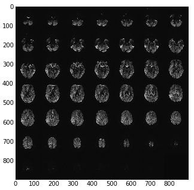

.. _dicom-mosaic:

=======================
 Siemens mosaic format
=======================

Siemens mosaic format is a way of storing a 3D image in a DICOM_ image
file.  The simplest DICOM_ images only knows how to store 2D files.  For
example, a 3D image in DICOM is usually stored as a series of 2D slices,
each slices as a separate DICOM image. .  Mosaic format stores the 3D
image slices as a 2D grid - or mosaic.

For example here are the pixel data as loaded directly from a DICOM image
with something like::

   import matplotlib.pylab as plt
   import dicom
   dcm_data = dicom.read_file('my_file.dcm')
   plt.imshow(dcm_data.pixel_array)
   

DICOM orientation for mosaic
============================

See :ref:`dicom-pcs` and :ref:`dicom-orientation`.  We want a 4 x 4
affine $A$ that will take us from (transposed) voxel coordinates in the
DICOM image to mm in the :ref:`dicom-pcs`.  See :ref:`ij-transpose` for
what we mean by transposed voxel coordinates.

We can think of the affine $A$ as the (3,3) component, $RS$, and a (3,1)
translation vector $\mathbf{t}$.  $RS$ can in turn be thought of as the
dot product of a (3,3) rotation matrix $R$ and a scaling matrix $S$,
where ``S = diag(s)`` and $\mathbf{s}$ is a (3,) vector of voxel sizes.
$\mathbf{t}$ is a (3,1) translation vector, defining the coordinate in
millimeters of the first voxel in the voxel volume (the voxel given by
``voxel_array[0,0,0]``).

In the case of the mosaic, we have the first two columns of $R$ from the
``ImageOrientationPatient`` DICOM field.  To make a full rotation
matrix, we can generate the last column from the cross product of the
first two.  However, Siemens defines, in its private :ref:`csa-header`,
a ``SliceNormalVector`` which gives the third column, but possibly with
a z flip, so that $R$ is orthogonal, but not a rotation matrix (it has a
determinant of < 0).

The first two values of $\mathbf{s}$ ($s_1, s_2$) are given by the second
and first values in the ``PixelSpacing`` field, respectively.  Why this
order? - see :ref:`ij-transpose`.  We get $s_3$ (the slice scaling
value) from ``SpacingBetweenSlices``.

The :ref:`spm-dicom` code has a comment saying that mosaic DICOM imagqes
have an incorrect ``ImagePositionPatient`` field. The
``ImagePositionPatient`` field usually gives the $\mathbf{t}$ vector.
The comments imply that Siemens has derived ``ImagePositionPatient``
from the (correct) position of the center of the first slice (once the
mosaic has been unpacked), but has then adjusted the vector to point to
the top left voxel, where the slice size used for this adjustment is the
size of the mosaic, before it has been unpacked.  Let's call the correct
position in millimeters of the center of the first slice $\mathbf{c} =
[c_x, c_y, c_z]$.  We have the derived $RS$ matrix from the calculations
in :ref:`dicom-orientation`. The unpacked (eventual, real) slice
dimensions are $(rd_{rows}, rd_{cols})$ and the mosaic dimensions are
$(md_{rows}, md_{cols})$.  The ``ImagePositionPatient`` vector
$\mathbf{i}$ resulted from:

.. math::

   \mathbf{i} = \mathbf{c} + RS 
      \begin{bmatrix} -(md_{cols}-1) / 2\\
                      -(md_{rows}-1) / 2\\
                      0 \end{bmatrix}

Note that the vector has $md_{cols}$ is the first value, $md_{rows}$ is
the second.  This follows from the :ref:`ij-transpose`.  The transpose
means that the first input coordinate is the column index, and the
second is the row index.

To correct the faulty translation, we reverse it, and add the correct
translation for the unpacked slice size $(rd_{rows}, rd_{cols})$, giving
the true image position $\mathbf{t}$:

.. math::

   \mathbf{t} = \mathbf{i} - 
                (RS \begin{bmatrix} -(md_{cols}-1) / 2\\
                                    -(md_{rows}-1) / 2\\
                                     0 \end{bmatrix}) +
                (RS \begin{bmatrix} -(rd_{cols}-1) / 2\\
                                    -(rd_{rows}-1) / 2\\
                                     0 \end{bmatrix})

Because of the final zero in the voxel translations, this simplifies to:

.. math::

   \mathbf{t} = \mathbf{i} + 
                Q \begin{bmatrix} (md_{cols} - rd_{cols}) / 2 \\
                                  (md_{rows} - rd_{rows}) / 2 \end{bmatrix}

where: 

.. math::

   Q = \begin{bmatrix} rs_{11} & rs_{12} \\
                       rs_{21} & rs_{22} \\
                       rs_{31} & rs_{32} \end{bmatrix}

Data scaling
============

SPM gets the DICOM scaling, offset for the image ('RescaleSlope',
'RescaleIntercept').  It writes these scalings into the nifti_ header.
Then it writes the raw image data (unscaled) to disk.  Obviously these
will have the corrent scalings applied when the nifti image is read again.

A comment in the code here says that the data are not scaled by the
maximum amount.  I assume by this they mean that the DICOM scaling may
not be the maximum scaling, whereas the standard SPM image write is,
hence the difference, because they are using the DICOM scaling rather
then their own.  The comment continues by saying that the scaling as
applied (the DICOM - not maximum - scaling) can lead to rounding errors
but that it will get around some unspecified problems.

.. include:: ../links_names.txt
