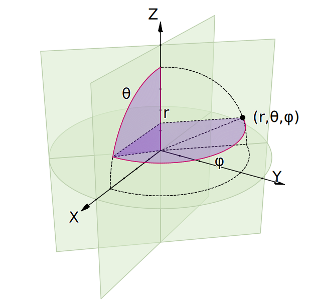

.. _spherical:

=======================
 Spherical coordinates
=======================

There are good dicussions of spherical coordinates in `wikipedia
spherical coordinate system`_ and `Mathworld spherical coordinate
system`_.

There is more information in the docstring for the
:func:`~dipy.core.geometry.cart2sphere` function.

Here is a good illustration we made from the scripts kindly provided by
`Jorge Stolfi`_ on wikipedia.

.. _`Jorge Stolfi`: http://commons.wikimedia.org/wiki/User:Jorge_Stolfi

.. include:: ../links_names.txt
